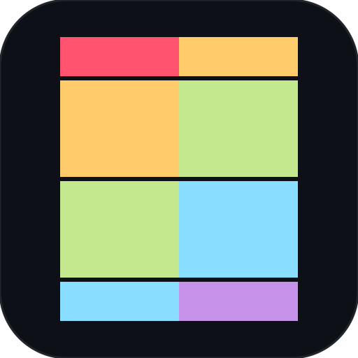

# Codast (`codast` / `cai`)

<p align="center">
  
</p>

<p align="center">
  <strong>Local-first, AI-powered developer CLI and intelligence engine for multi-language codebases.</strong><br>
  Deep AST analysis • Relational call graphs • Local vector retrieval • Multi-turn memory • Grounded line citations
</p>

---

## ⚡ Quick Start

### 1. Install Globally

```bash
npm install -g @pra9v/codast
```

*(Alternatively, run instantly without installing via `npx @pra9v/codast`)*

### 2. Configure (Only 1 API Key Needed)

Codast works out of the box with a single free **Google Gemini API key** for both reasoning and embeddings:

```bash
codast config set api-key <YOUR_GEMINI_API_KEY>
```

> **Prefer 100% offline with zero keys?** Run with local Ollama:
> ```bash
> codast config set provider ollama
> ```

### 3. Launch the REPL

Navigate to any codebase directory and start chatting:

```bash
codast
# or
cai
```

---

## ⚙️ Configuration Modes

Codast stores credentials globally in `~/.codebase-ai/config.json` so you configure once for all repositories:

| Mode | Setup Command | Keys Needed | Description |
| :--- | :--- | :---: | :--- |
| **Google Gemini (Default)** | `codast config set api-key <KEY>` | **1 Key** | Uses Gemini for both chat reasoning and code embeddings. Free tier friendly. |
| **100% Offline (Ollama)** | `codast config set provider ollama` | **0 Keys** | Completely private and local via `qwen2.5-coder` + `nomic-embed-text`. |
| **Hybrid (Voyage AI + Gemini)** | `codast config set voyage-key <KEY>` | **2 Keys** | Uses specialized `voyage-code-2` for code embeddings with Gemini reasoning. |

### View Active Configuration

```bash
codast config show
```

---

## 💬 Interactive REPL & Features

### Live `@` Mentions & Autocomplete
Type `@` inside the REPL to search and autocomplete indexed files, directories, and AST symbols (functions, classes, hooks). Mentioned targets receive maximum relevance boosting during retrieval:

```text
> explain how @src/services/auth.ts handles token expiration
> how does @AuthService.login interact with @db/schema.sql?
> trace the call flow of @handleRequest
```

### Real-Time Background File Watcher
When the REPL is open, a silent background file watcher monitors your workspace. Saving or deleting a file in your editor automatically performs an incremental AST re-parse and vector sync in **$< 30\text{ms}$** without re-indexing the whole project.

### Conversational Memory & Fast Path
- **Multi-Turn Context**: Maintains conversational thread across turns with sliding-window token budgeting.
- **0-Token Fast-Path**: Common greetings and pleasantries (`hey`, `hi`, `thanks`, `who are you`) respond instantly without vector lookups or token waste.

---

## 🛠 Command Reference

### In-REPL Slash Commands

| Command | Action |
| :--- | :--- |
| `/diagram [target]` | Generate Mermaid architecture graphs (`graph TD`), sequence call flows, or ASCII trees |
| `/tree [path]` | Visualize directory tree with file line counts (e.g. `/tree @src/core/`) |
| `/status` | View repository metrics, indexed files, symbols, chunks, and active models |
| `/files [filter]` | List indexed source files with optional filter |
| `/config` | View active API keys, provider settings, and model configurations |
| `/reset` | Clear conversation history |
| `/index` | Force a full re-scan and re-index of the codebase |
| `/clear` | Clear terminal screen and reset view |
| `/help` | Show command reference |
| `/exit` | Exit the session |

### Terminal CLI Commands

```bash
# Start interactive REPL
codast

# Run a one-off query from terminal
codast ask "How does user authentication work?"

# Generate architecture or sequence diagrams
codast diagram [target] [--type architecture|sequence] [--ascii]

# Real-time standalone filesystem watcher
codast watch

# Force re-index codebase
codast index --force

# View repository index statistics
codast status
```

---

## 🌐 Supported Languages

| Language | Extensions | Extracted Constructs |
| :--- | :--- | :--- |
| **TypeScript & JavaScript** | `.ts`, `.tsx`, `.js`, `.jsx`, `.mjs`, `.cjs` | Full AST via `ts-morph` (Classes, methods, React components, hooks, types, imports/exports, call edges) |
| **Python** | `.py`, `.pyi` | Classes, methods, async defs, decorators, docstrings, imports |
| **Go** | `.go` | Structs, interfaces, receiver methods `(r *Type)`, functions, packages |
| **Rust** | `.rs` | Structs, enums, traits, `impl` blocks, `pub fn`, `use` statements |
| **Java & Kotlin** | `.java`, `.kt` | Classes, interfaces, records, methods, annotations |
| **C / C++ / C#** | `.c`, `.cpp`, `.h`, `.hpp`, `.cs` | Functions, classes, structs, namespaces, `#include` |
| **PHP & Ruby** | `.php`, `.rb` | Classes, methods, modules, functions, `require`/`use` |
| **Data & Config** | `.sql`, `.json`, `.yaml`, `.md`, `.html`, `.css` | SQL tables/views, Markdown sections, JSON/YAML schemas |

---

## 🧪 Testing

Codast includes 11 automated test suites covering all core subsystems:

```bash
npm test
```

- `test:scanner` — File filtering & ignore rules
- `test:ast` — AST extraction & relationship resolution
- `test:sqlite` — Structured metadata & graph persistence
- `test:chunker` — AST-aware logical code chunking
- `test:vector` — LanceDB vector indexing & similarity search
- `test:retrieval` — Multi-modal hybrid ranking & retrieval
- `test:multi-lang` — Python, Go, Rust, Java AST parsing
- `test:history` — Multi-turn conversation memory
- `test:mentions` — `@` Mention parsing & relevance boosting
- `test:diagram` — Mermaid & ASCII diagram generation
- `test:watcher` — Incremental real-time AST re-indexing

---

## 📄 License

MIT © [Pranav](https://github.com/prannav225)
